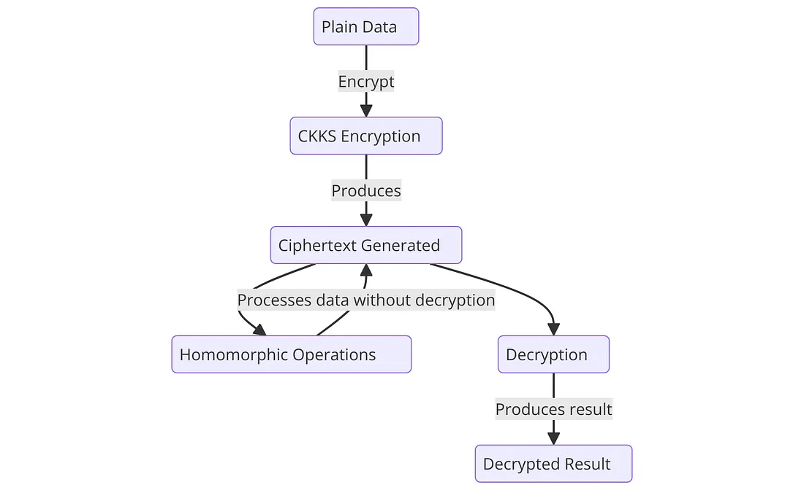

# Project 3: Privacy Through Homomorphic Encryption

## Privacy-Preserving Salary Audit

---

## 1. Project Overview

This project implements a secure **Privacy-Preserving Salary Audit** scenario using **Homomorphic Encryption (HE)**.
It addresses the problem where a **Data Holder (Employer)** needs to outsource statistical computations to a **Data Analyzer (Cloud Auditor)** without revealing raw salary data, ensuring compliance with privacy regulations such as **GDPR**.

### Core Functionality

* **Input:** A dataset of employee salaries (`salaries.csv`)
* **Process:**
  The Data Analyzer computes the **Sum** and **Mean** of the payroll **entirely on encrypted data**
* **Output:**
  Encrypted results returned to the Data Holder and decrypted locally

### Schemes Implemented

* **Paillier (PHE):**
  Uses the `phe` library for exact integer arithmetic (additive homomorphism)

* **CKKS (TenSEAL):**
  Uses the `tenseal` library for approximate vector arithmetic with SIMD support

---

## 2. Folder Structure

The codebase is modularized to clearly separate configuration, cryptographic logic, and user roles.

```text
SP_Project3/
│
├── Makefile               # Cross-platform automation script (Windows/Mac/Linux)
├── config.ini             # Configuration (dataset size, filenames)
├── dataset_gen.py         # Step 1: Generates the synthetic dataset
├── fhe_lib.py             # Wrapper classes for Paillier and TenSEAL libraries
├── users.py               # Step 2 & 3: Implements DataHolder and DataAnalyzer classes
├── main.py                # Main script that runs the full simulation
│
└── data/                  # Directory for all inputs and outputs (auto-created)
    ├── salaries.csv
    ├── encrypted_paillier.json
    └── ...
```

---

## 3. Prerequisites

Ensure you have **Python 3.8+** installed.

### Required Libraries

* `phe` – Paillier Homomorphic Encryption library
* `tenseal` – Homomorphic Encryption on Tensors (CKKS)
* `pandas` – CSV handling
* `numpy` – Numerical operations

---

## 4. How to Run

### Option A: Using `make` (Recommended)

A `Makefile` is provided to automate the workflow.

#### 1. Install dependencies

```bash
make setup
```

#### 2. Run the simulation

```bash
make run
```

This command:

1. Generates the dataset (`dataset_gen.py`)
2. Executes the full HE workflow (`main.py`)

---

### Option B: Manual Execution

If `make` is not available, execute the steps manually.

#### 1. Install dependencies

```bash
pip install phe tenseal pandas numpy configparser
```

#### 2. Generate the dataset

```bash
python dataset_gen.py
```

#### 3. Run the simulation

```bash
python main.py
```

---

## 5. Implementation Details

### The Scenario Roles (`users.py`)

#### Data Holder (HR Department)

* **Role:** Owner of the private key
* **Responsibilities:**

  * Reads the `Salary` column from `salaries.csv`
  * Encrypts the salary data
  * Sends ciphertexts to the Data Analyzer
  * Decrypts the encrypted results received back

#### Data Analyzer (Cloud Auditor)

* **Role:** Performs computations without access to plaintext data or private keys
* **Responsibilities:**

  * Computes **Sum** via homomorphic addition
  * Computes **Mean** via scalar multiplication (multiplying the sum by (1/N))

---

### The Encryption Schemes (`fhe_lib.py`)

| Feature           | Paillier                         | CKKS (TenSEAL)                    |
| ----------------- | -------------------------------- | --------------------------------- |
| Library           | `phe`                            | `tenseal`                         |
| Type              | Partially Homomorphic (Additive) | Leveled Homomorphic (Approximate) |
| Data Structure    | List of Encrypted Integers       | Single Encrypted Vector           |
| Precision         | Exact (Integer)                  | Approximate (Floating-point)      |
| Computation Style | Iterative (Slower)               | SIMD Vectorized (Faster)          |

---

## 6. Configuration

Simulation parameters can be adjusted via `config.ini`.

### Configurable Options

* **`DATA_SIZE`** – Number of employees to generate (default: `13000`)
* **`RAW_DATASET`** – Name of the input CSV file

